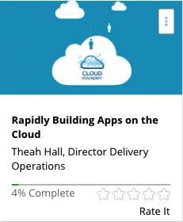

```
Roberto Nogueira  BSd EE, MSd CE
Solution Integrator Experienced - Certified by Ericsson
```

# Rapidly Building Apps on The Cloud



**About the Course**

-

## Contents

```
Section: 1
4 / 4
Let's Get Started!
[x] 1. Course Introduction - Matt Fox 4:16
[x] 2. Instructor Introduction: Marcel Ribas 0:37
[x] 3. Instructor Introduction: Vinay Gupta 0:48
[x] 4. Lab setup Instructions and Free Bluemix Trial Account set up 0:00

Section: 2
0 / 1
Overview
[x] 5. Cloud Foundry Overview 8:37

Section: 3
0 / 1
A Tour of Cloud Foundry
[x] 6. Cloud Foundry Tour 6:59

Section: 4
0 / 10
Your First Deploy
[x]  7. Starters and Runtimes 1:11
[x]  8. Exercise 4a - Deploy your first application 0:00
[x]  9. Exercise 4a - Video Solution 3:29
[x] 10. Working with the Command Line Interface (CLI) 3:32
[x] 11. Exercise 4b - Deploy and update an application using the CLI 0:00
[ ] 12. Exercise 4b - Video Solution 14:53
[ ] 13. Working with Eclipse 2:16
[ ] 14. Exercise 4c - Deploy and update an application with Eclipse 0:00
[ ] 15. Exercise 4c - Video Solution 13:18
[ ] 16. Summary 0:40

Section: 5
0 / 11
DevOps
[ ] 17. Introduction to DevOps Services 1:57
[ ] 18. Exercise a - Integration with DevOps Services 0:00
[ ] 19. Exercise a- Video Solution 4:34
[ ] 20. Collaborating with DevOps Services 4:12
[ ] 21. Exercise b - Working in DevOps services 0:00
[ ] 22. Exercise b - Video Solution 4:28
[ ] 23. Exercise c - DevOps Services Integration with Eclipse 0:00
[ ] 24. Exercise c - Video Solution 6:55
[ ] 25. Markdown 3:34
[ ] 26. Exercise d - Modify the readme.md for your project 0:00
[ ] 27. Exercise d - Video Solution 1:49

Section: 6
0 / 13
Create your App
[ ] 28. Environment Variables 1:08
[ ] 29. Exercise 6a – Your first Node.js application 0:00
[ ] 30. Exercise 6a - Video Solution 4:59
[ ] 31. package.json 0:45
[ ] 32. Exercise 6b – Working with Node using Eclipse 0:00
[ ] 33. Exercise 6b - Video Solution 5:44
[ ] 34. Manifest File 1:00
[ ] 35. Exercise 6c – Working with Node using DevOps Services 0:00
[ ] 36. Exercise 6c - Video Solution 8:16
[ ] 37. .cfignore 0:28
[ ] 38. Exercise 6d – Selecting files to include in your application 0:00
[ ] 39. Exercise 6d - Video Solution 4:34
[ ] 40. Summary 0:51

Section: 7
0 / 7
Services
[ ] 41. Cloud Foundry Services 1:07
[ ] 42. Exercise 7a – Adding a service to an application 0:00
[ ] 43. Exercise 7a - Video Solution 13:20
[ ] 44. Making Money with your own services 3:04
[ ] 45. Exercise 7b – Creating a user-provided service 0:00
[ ] 46. Exercise 7b - Video Solution 6:14
[ ] 47. Summary 0:29

Section: 8
0 / 4
How it Works
[ ] 48. Cloud Foundry Architecture 7:23
[ ] 49. Exercise 8a – Specifying a buildpack when deploying an application 0:00
[ ] 50. Exercise 8a - Video Solution 4:38
[ ] 51. Services Architecture 1:15

Section: 9
0 / 12
Application for Node.js
[ ] 52. Unit 1 - Introduction to Server-Side JavaScript Programming 8:32
[ ] 53. Exercise 1 0:00
[ ] 54. Exercise 1 - Video Solution Part 1 15:00
[ ] 55. Exercise 1 - Video Solution Part 2 13:16
[ ] 56. Unit 2 - Asynchronous I/O with Callback Programming 11:22
[ ] 57. Exercise 2 0:00
[ ] 58. Exercise 2 Video Solution 16:00
[ ] 59. Exercise 2 - Video Solution Part 2 16:53
[ ] 60. Unit 3 - Express web application framework 10:58
[ ] 61. Exercise 3 0:00
[ ] 62. Exercise 3 - Video Solution Part 1 19:56
[ ] 63. Exercise 3 - Video Solution Part 2 18:04

Section: 10
0 / 2
IBM Containers
[ ] 64. 10.a - Docker Containers and Virtual Machines Concepts 0:00
[ ] 65. Exercise 10.a - Using IBM Containers in Bluemix 0:00

Section: 11
0 / 12
Data Services on Bluemix
[ ] 66. Cloud Data Services 0:00
[ ] 67. Cloudant Overview 0:00
[ ] 68. Exercise 11.a - Using Cloudant NoSQLDB 13:18
[ ] 69. dashDB Overview 0:00
[ ] 70. Exercise 11.b - Working with dashDB in IBM Bluemix 0:00
[ ] 71. Exercise 11.c - Working with DataWorks Forge 0:00
[ ] 72. 11.d - Describe different types of data services available in IBM Bluemix PaaS 0:00
[ ] 73. 11.e - Describe the unique features of IBM Bluemix PaaS data services 0:00
[ ] 74. 11.f - Manage Instances of IBM Bluemix PaaS data services 0:00
[ ] 75. Exercise 11.f - Video Solution (C5020-286 Section 6.3 Lab) 0:00
[ ] 76. 11.g - Describe the IBM DataWorks service for Bluemix (C5020-286 Section 6.4) 0:00
[ ] 77. Exercise 11.g - Video Solution (C5020-286 Section 6.4 Lab) 0:00

Section: 12
0 / 1
IBM Watson
[ ] 78. Personality Insights 12:49

Section: 13
0 / 13
Enhancing Cloud Applications using Managed Services
[ ] 79. 13.a - Using Data Cache Services 5:58
[ ] 80. 13.b - Single Sign On Service in Bluemix 0:00
[ ] 81. 13.c - Overview of Alchemy API 0:00
[ ] 82. 13.d - Using Object Storage Service in Bluemix 0:00
[ ] 83. 13.e - Improve Performance and Scalability of IBM Bluemix PaaS Apps with Caching 0:00
[ ] 84. Exercise 13.e - Video Solution (C5020-286 Section 4.1 Lab) 0:00
[ ] 85. 13.f - External authentication for IBM Bluemix PaaS with Single Sign On (SSO) 0:00
[ ] 86. 13.g - IBM Bluemix PaaS applications using Messaging Services 0:00
[ ] 87. Exercise 13.g - Video Solution (C5020-286 Section 4.3 & 4.4 Lab) 0:00
[ ] 88. Exercise 13.f - Video Solution (C5020-286 Section 4.2 Lab) 0:00
[ ] 89. 13.h-Describe cognitive capabilities in IBM Bluemix PaaS (C5020-286 Section 4.5) 0:00
[ ] 90. Exercise 13.h - Video Solution (C5020-286 Section 4.5 Lab) 0:00
[ ] 91. 13.i - IBM Object Storage Service in Bluemix (C5020-286 Section 4.6) 0:00

Section: 14
0 / 8
Implementing Cloud Ready Applications (C5020-286 Module 3)
[ ] 92. 14.a - IBM Bluemix PaaS application following the Twelve-Factor App Methodology 0:00
[ ] 93. 14.b - Scaling concepts and steps to scale an application in IBM Bluemix PaaS 0:00
[ ] 94. Exercise 14.b - Video Solution (C5020-286 Section 3.2 Lab) 0:00
[ ] 95. 14.c - Debug a Cloud application using development mode of IBM Bluemix PaaS 0:00
[ ] 96. Exercise 14c. - Video Solution (C5020-286 Section 3.3 Lab) 0:00
[ ] 97. 14.d - Perform load testing on Cloud applications using simulated loads 0:00
[ ] 98. Exercise 14.d - Video Solution (C5020-286 Section 3.4 Lab) 0:00
[ ] 99. 14.e - Explain various methods to monitor an application in IBM Bluemix PaaS 0:00

Section: 15
0 / 7
Additional Material: DevOps
[ ] 100. Understanding DevOps 0:00
[ ] 101. DevOps: Where to Start 0:00
[ ] 102. Introducing IBM DevOps Services and how it integrates with Bluemix 0:00
[ ] 103. An Overview of IBM Bluemix DevOps Services 0:00
[ ] 104. Intro to Bluemix & DevOps Services: Part 1, Deploy and Update a Simple App 0:00
[ ] 105. Intro to Bluemix & DevOps Services: Part 2, Deploying an App that Uses Bluemix 0:00
[ ] 106. Building a Java EE webapp on IBM Bluemix Using Watson and Cloudant 0:00
```
